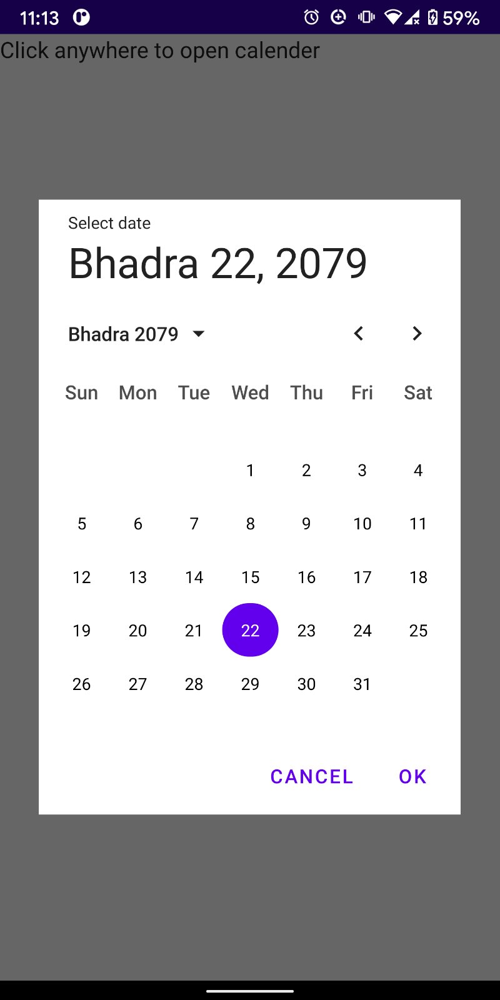
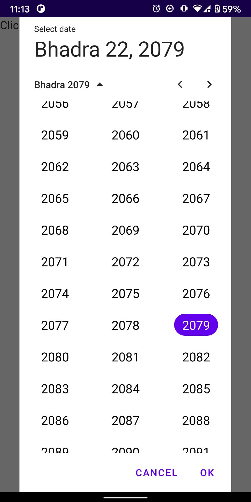

## compose-nepcal (Nepali date picker and converter for compose)

Current version **1.0.0-beta02**

This is a android compose-ui date picker library for nepali (BS) calendar.

#### Requirements

1. Compose 1.2.0+ (kotlin 1.7.0+)
2. Compose Material 1.1.1
3. Java8 Date Time Api's (available through coreLibraryDesugaring)

#### Step 1: Enable `coreLibraryDesugaring`

Before getting started, make sure `coreLibraryDesugaring` is enabled as this library depends on `java8 LocalDateTime`. Learn  
more about desugaring at [developer.android.com](https://developer.android.com/studio/write/java8-support).

```groovy
compileOptions {  
    coreLibraryDesugaringEnabled true
    sourceCompatibility JavaVersion.VERSION_1_8
    targetCompatibility JavaVersion.VERSION_1_8
}  

kotlinOptions {  
    jvmTarget = "1.8"
}  

dependencies {  
    coreLibraryDesugaring 'com.android.tools:desugar_jdk_libs:1.1.5'
}  
```

#### Step 2: Add dependency compose 1.1.1

Please also note the library leverages `Compose MaterialTheme` for styling. To get started include  
following maven dependency in your app gradle file.

```groovy
implementation 'io.github.aagitoex:compose-nepcal:0.0.1-alpha01'  
```

#### Step 2: Add dependency compose 1.2.0+

```groovy
implementation 'io.github.aagitoex:compose-nepcal:1.0.0-beta02'  
```

#### Step 3: Display date picker dialog

The library provides a date picker dialog api that is similar to `Dialog` in compose.

```kotlin
Surface() {  
    var showDateDialog by remember {
        mutableStateOf(false) 
    }    
    if (showDateDialog) {
        CalendarDialog(
            selectedDate = LocalDate.now()!!,
            onDismissRequest = { showDateDialog = false },
            onDateChange = {
                    localDate: LocalDate ->
            }  
        )
    }
}  
```

This project uses [nepdate](https://github.com/AagitoEx/nepdate) java lib and so all **date conversion**  
functions are **available** for you to use. Head over to the link for the date converter API docs.

### Sample Screenshots

|  |  |
|------------------------------|-----------------------------|